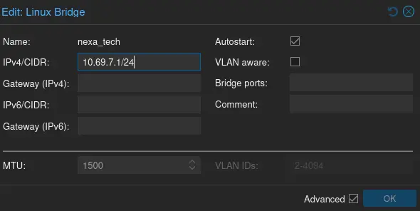
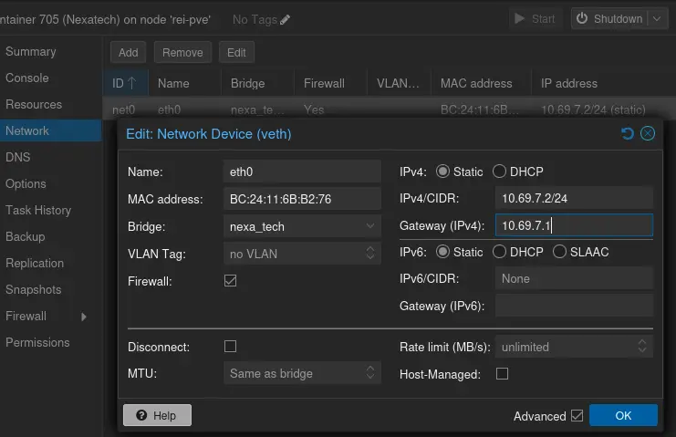
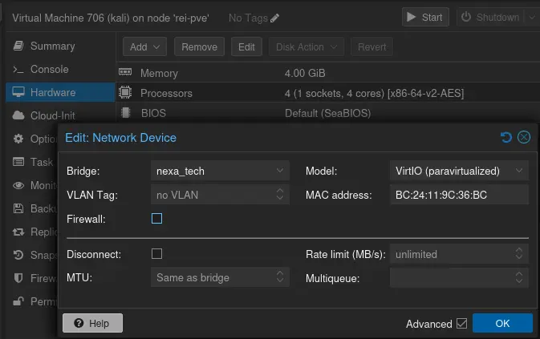
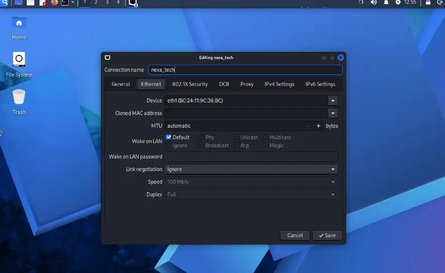
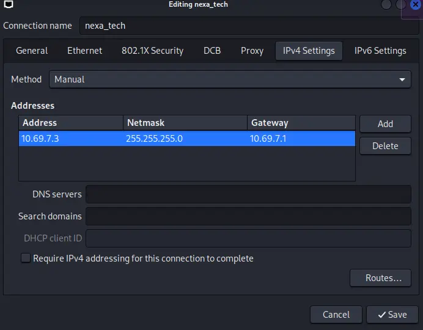
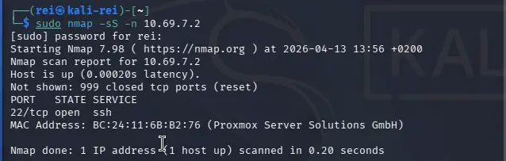
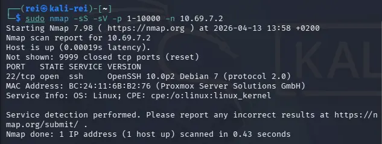
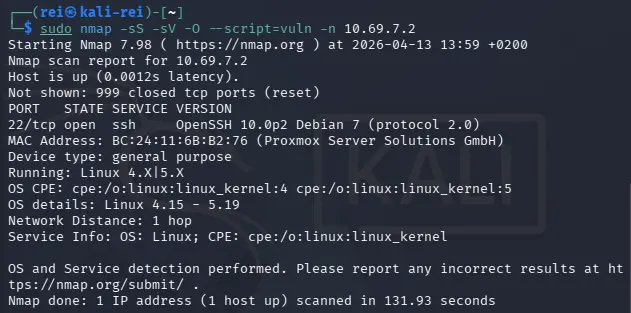
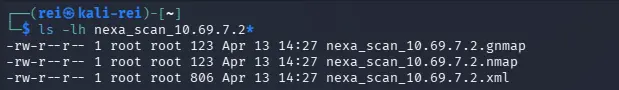
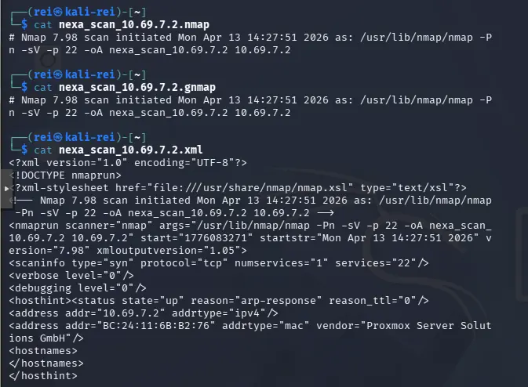

---

---

↑ [cartographie de l'infrastructure](cartographie_infrastructure.md)

---

# Cartographie NexaTech

## 1. Mise en place du réseau

Un réseau isolé `nexa_tech` a été créé sur Proxmox.



## 2. Configuration de la VM et du LXC

### Adressage IP

- Bridge : `10.69.7.1/24`
- Kali Linux : `10.69.7.3`
- Debian LXC NexaTech : `10.69.7.2`

Objectif : isoler la cible Debian et permettre les scans réseau depuis Kali.

### Ajout de l'interface reseau sur le LXC



### Ajout de l'interface sur la VM kali



Configuration de l'interface dans kali :





---

## 3. Scan rapide

Commande :

```bash
sudo nmap -sS -n 10.69.7.2
```



Résultat :

- 22/tcp open ssh

---

## 3. Scan détaillé

Commande :

```bash
sudo nmap -sS -sV -p 1-10000 -n 10.69.7.2
```



Résultat :

- 22/tcp open ssh
- OpenSSH 10.0p2 Debian 7

---

## 4. Détection OS

Commande :

```bash
sudo nmap -sS -sV -O --script=vuln -n 10.69.7.2
```



Résultat :

- Linux kernel 4.15 - 5.19
- Service : SSH
- Hôte Proxmox détecté via MAC

### Export des resultats

```bash
sudo nmap -sS -sV -oA nexa_scan_10.69.7.2 10.69.7.2
```





---

## 5. Service web identifié

Après installation Apache + DVWA :

- 80/tcp open http
- Server: Apache/2.4.66 Debian
