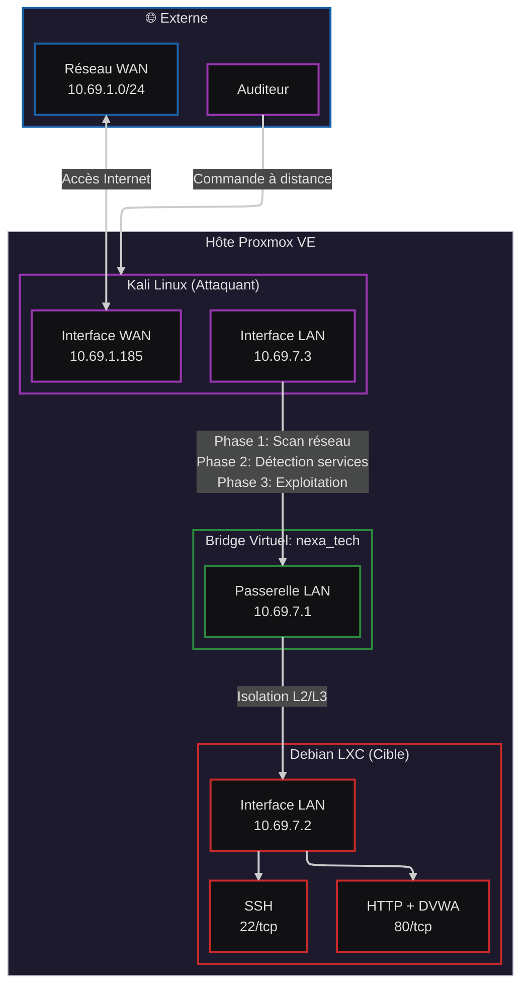

↑ [README](../README.md)

---

# Cartographie de l'Infrastructure NexaTech

## Fichier de travail opérationnel

Pendant la phase active de reconnaissance et d'exploitation, l'ensemble des commandes, résultats bruts et notes intermédiaires ont été consignés dans un fichier dédié afin de garantir la traçabilité et la reproductibilité des actions.

- [apres_scan](apres_scan.md)

## Objectif de la phase

L'objectif de cette phase est d'établir une visibilité complète sur l'infrastructure cible. Cette étape de reconnaissance passive et active permet de :

1. Identifier les actifs (assets) présents sur le réseau.
2. Déterminer la topologie réseau et les segments d'isolation.
3. Répertorier les services exposés et leurs versions pour identifier les vecteurs d'attaque potentiels.

## Architecture de l'environnement de test

Afin de garantir un environnement de simulation réaliste et isolé, nous avons déployé une infrastructure virtualisée sous **Proxmox VE**.



### Segmentation Réseau

Pour respecter les bonnes pratiques de sécurité, un réseau virtuel dédié `nexa_tech` a été configuré. Ce réseau permet d'isoler les machines vulnérables du réseau hôte, simulant ainsi un segment DMZ ou un réseau interne d'entreprise.

#### Plan d'adressage IP (Subnet `10.69.7.0/24`)

| Machine        | Rôle             | Interface     | Adresse IP    | Note                           |
| :------------- | :--------------- | :------------ | :------------ | :----------------------------- |
| **Proxmox VE** | Hyperviseur      | Bridge        | `10.69.7.1`   | Passerelle du réseau de test   |
| **Kali Linux** | Station d'audit  | Interface LAN | `10.69.7.3`   | Machine d'attaque (Pivot)      |
|                |                  | Interface WAN | `10.69.1.185` | Accès Internet (Recon externe) |
| **Debian LXC** | Serveur NexaTech | Interface LAN | `10.69.7.2`   | Cible (Serveur Web & RH)       |

## Processus de Reconnaissance et Scan

La phase de découverte a été réalisée par étapes progressives, de la détection d'hôtes à l'analyse approfondie des services.

### 1. Découverte des hôtes (Host Discovery)

**Méthodologie :** Utilisation d'un scan SYN rapide pour identifier les machines actives sans générer un trafic excessif.

**Commande :**

```bash
sudo nmap -sS -n 10.69.7.2
```

**Résultat :**

- **Port 22/tcp :** `open` (SSH)
- _Observation : Un service de gestion à distance est exposé sur la cible._

### 2. Analyse des services (Service Enumeration)

**Méthodologie :** Scan complet des ports (1-10000) avec détection de version (`-sV`) pour identifier précisément les bannières de services.

**Commande :**

```bash
sudo nmap -sS -sV -p 1-10000 -n 10.69.7.2
```

**Résultat :**

- **Port 22/tcp :** `open` | `OpenSSH 10.0p2 Debian 7`
- _Observation : Identification de la version précise du service SSH pour recherche ultérieure de vulnérabilités (CVE)._

### 3. Fingerprinting OS et Analyse de Vulnérabilités

**Méthodologie :** Utilisation de scripts NSE (_Nmap Scripting Engine_) pour la détection de l'empreinte système (OS) et le scan de vulnérabilités connues (`--script=vuln`).

**Commande :**

```bash
sudo nmap -sS -sV -O --script=vuln -n 10.69.7.2
```

**Résultat :**

- **OS Detection :** Linux kernel 4.15 - 5.19
- **Analyse de vulnérabilités :** Identification de services potentiellement vulnérables via les scripts NSE.
- **Note technique :** La détection de l'hôte via l'adresse MAC indique une proximité dans le même segment de couche 2.

### 4. Identification de la surface Web

**Méthodologie :** Vérification de l'exposition des services HTTP après déploiement de l'application cible.

**Résultat de l'audit :**

- **Port 80/tcp :** `open` | `HTTP`
- **Server Banner :** `Apache/2.4.66 Debian`
- **Application détectée :** DVWA (Damn Vulnerable Web Application) déployée sur le serveur Debian.

## Conclusion de la cartographie

L'infrastructure cible présente une surface d'attaque comprenant un service SSH et un serveur Web Apache. La présence d'un service SSH avec une version identifiable et d'un serveur web sans configuration de sécurité apparente constitue les premiers vecteurs d'investigation pour la phase suivante.
