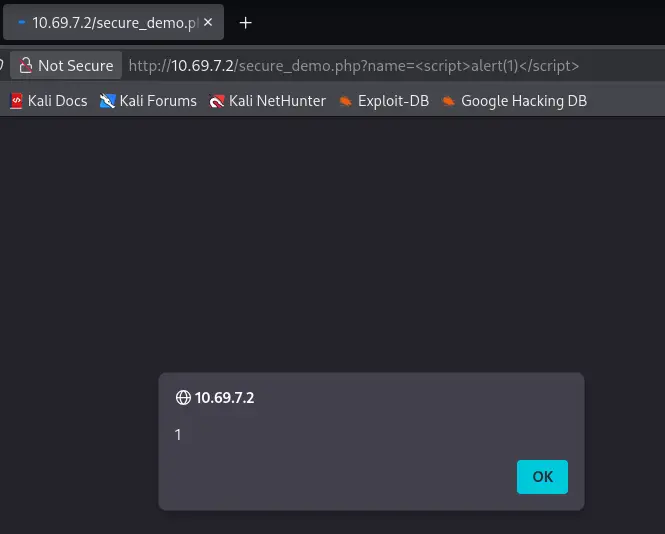

↑ [README](README.md)  | [Rapport d'audit](../rapport_audit.md)

---

# Corrections applicatives (Secure Coding)

## Objectif de la phase

1. **Correction** des vulnérabilités identifiées (SQLi, XSS, mauvaise configuration HTTP).
2. **Application des bonnes pratiques** de développement sécurisé (secure coding).
3. **Documentation des correctifs** avec explication technique.
4. **Validation** de l’efficacité des correctifs.

## Environnement de Test

Les corrections sont appliquées sur la même instance **DVWA** (Damn Vulnerable Web Application) déployée sur le LXC Debian (voir [infrastructure](cartographie_infrastructure/cartographie_infrastructure.md)).

**Prérequis :**

- Accès au code source PHP de l’application.
- PDO activé pour la base de données.
- Serveur Apache avec possibilité de modifier les en-têtes HTTP.

## Analyse et correction des vulnérabilités

### 1. SQL Injection (SQLi)

#### Code vulnérable (avant correction)

```php
$query = "SELECT * FROM users WHERE name = '".$_GET['name']."';";
```

**Problème :**

Concaténation directe d’une entrée utilisateur (`$_GET['name']`) dans la requête SQL. Un attaquant peut injecter du code SQL (`' OR '1'='1`) pour modifier la logique de la requête.

#### Code corrigé

```php
$stmt = $pdo->prepare("SELECT * FROM users WHERE name = ?");
$stmt->execute([$_GET['name']]);
$users = $stmt->fetchAll();
```

#### Explication technique

**Requêtes préparées (Prepared Statements) :**

La requête SQL et les données sont envoyées séparément au serveur de base de données. Le moteur SQL compile la structure de la requête **avant** d’y injecter les paramètres. Ainsi, même si un utilisateur soumet du code SQL malveillant, celui-ci est traité comme une simple chaîne de caractères, et non comme une instruction exécutable.

**Avantages :**

- Protection automatique contre les injections SQL.
- Amélioration des performances pour les requêtes répétées.
- Séparation claire entre logique SQL et données.

**Impact de la correction :** **CRITIQUE** → **AUCUN**

Supprime totalement la possibilité d’injection SQL sur ce vecteur.

**Remédiation complémentaire :**

- Valider le type de donnée attendu (ex : `is_string()` ou filtre `FILTER_SANITIZE_STRING`).
- Utiliser les `bindParam()` pour un contrôle plus fin des types.

### 2. Cross-Site Scripting (XSS) - Reflected

#### Code vulnérable (avant correction)

```php
echo "Bonjour " . $_GET['name'];
```

**Problème :**

Affichage non filtré de la valeur `$_GET['name']` directement dans le HTML. Un attaquant peut injecter `<script>alert("XSS")</script>` qui sera exécuté par le navigateur de la victime.

**Exécution du code vulnérable :**



#### Code corrigé

```php
echo "Bonjour " . htmlspecialchars($_GET['name'], ENT_QUOTES, 'UTF-8');
```

#### Explication technique

**Encodage de sortie (Output Encoding) :**  
La fonction `htmlspecialchars()` convertit les caractères spéciaux HTML en entités HTML. Par exemple :

- `<` devient `&lt;`
- `>` devient `&gt;`
- `"` devient `&quot;`
- `'` devient `&#039;` (grâce à `ENT_QUOTES`)

Ainsi, un script injecté devient du texte inoffensif affiché à l’écran, mais jamais interprété comme du code JavaScript.

**Paramètres utilisés :**

- `ENT_QUOTES` : encode les guillemets doubles **et** simples.
- `'UTF-8'` : garantit un encodage cohérent avec l’application.

**Impact de la correction :** **ÉLEVÉ** → **NUL**

Empêche totalement l’exécution de scripts arbitraires dans le navigateur.

**Remédiation complémentaire :**

- Appliquer systématiquement `htmlspecialchars()` à **toute** donnée utilisateur affichée.
- Ajouter une **Content Security Policy (CSP)** pour bloquer les scripts non autorisés.

### 3. Mauvaise configuration HTTP (Security Misconfiguration)

#### Code vulnérable (avant correction)

Aucun en-tête de sécurité HTTP n’était configuré. Le serveur divulguait sa version précise (`Server: Apache/2.4.66 (Debian)`).

#### Code corrigé

```php
header("X-Frame-Options: DENY");
header("X-Content-Type-Options: nosniff");
header("X-XSS-Protection: 1; mode=block");
```

#### Explication technique

**1. `X-Frame-Options: DENY`**

Empêche l’intégration de la page dans une `<iframe>` (Clickjacking). L’option `DENY` interdit tout cadre, quelle que soit l’origine.

**2. `X-Content-Type-Options: nosniff`**

Empêche le navigateur d’interpréter un fichier avec un type MIME différent de celui déclaré par le serveur (ex : exécuter un fichier `.txt` comme du JavaScript). Bloque les attaques de type _MIME type confusion_.

**3. `X-XSS-Protection: 1; mode=block`**

Active le filtre XSS intégré des navigateurs (ancienne génération) et demande le blocage total de la page si une attaque est détectée. Utile en complément de `htmlspecialchars()`.

**Remarque :**

Ces en-têtes ne sont pas une protection absolue, mais ils constituent une **couche défensive supplémentaire**. Les versions modernes recommandent plutôt une **CSP** (Content Security Policy).

**Impact de la correction :** **FAIBLE** → **Négligeable**

Réduit la surface d’attaque pour le vol d’informations et l’exécution de contenu non fiable.

**Remédiation complémentaire :**

- Ajouter `Strict-Transport-Security (HSTS)` pour forcer le HTTPS.
- Désactiver la signature du serveur (`ServerTokens Prod` sous Apache).
- Mettre en place une **CSP** robuste (ex : `default-src 'self'`).

## Synthèse des corrections appliquées

| Vulnérabilité          | Niveau de risque initial | Niveau après correction | Technique de correction         |
| ---------------------- | ------------------------ | ----------------------- | ------------------------------- |
| SQL Injection          | **CRITIQUE**             | **AUCUN**               | Requêtes préparées (PDO)        |
| XSS (Reflected)        | **ÉLEVÉ**                | **NUL**                 | `htmlspecialchars()` + encodage |
| Information Disclosure | **FAIBLE**               | **Négligeable**         | En-têtes de sécurité HTTP       |

## Conclusion de la phase

Les trois vulnérabilités critiques et élevées ont été corrigées par l’implémentation de bonnes pratiques de développement sécurisé :

1. **Requêtes préparées** pour éliminer les injections SQL.
2. **Encodage systématique des sorties** pour neutraliser les XSS.
3. **Configuration minimale des en-têtes HTTP** pour réduire la surface d’attaque.

L’application n’est pas encore totalement durcie (manque CSP, HSTS, validation côté serveur), mais les vecteurs d’attaque les plus dangereux sont désormais bloqués. Une nouvelle phase d’audit est recommandée pour valider les correctifs et détecter d’éventuelles régressions.
