↑ [README](README.md)  | [Rapport d'audit](../rapport_audit.md)

---

# Hardening Server Windows

## Objectif de la phase

1. **Déploiement d'un contrôleur de domaine** Windows Server 2022 sur Proxmox.
2. **Configuration des stratégies de groupe (GPO)** pour renforcer l'authentification.
3. **Audit des comptes inactifs** et des groupes sensibles.
4. **Désactivation des protocoles vulnérables** (SMBv1, NTLMv1).
5. **Validation et traçabilité** des modifications appliquées.

## Environnement de Test

Le durcissement a été réalisé sur une instance **Windows Server 2022** déployée sur l'infrastructure Proxmox (voir [infrastructure](../cartographie_infrastructure/cartographie_infrastructure.md)).

**Spécifications :**

- OS : Windows Server 2022 Standard
- Rôle : Contrôleur de domaine (Active Directory)
- Domaine : `nexatech.local`
- Réseau : VLAN isolé (laboratoire)

## Déploiement de l'infrastructure

### 1. Création de la VM sur Proxmox

**Configuration matérielle :**

| Composant | Valeur attribuée          |
| --------- | ------------------------- |
| OS        | Windows Server 2022       |
| vCPU      | 4                         |
| RAM       | 4 Go (minimum recommandé) |
| Disque    | 50 Go (dynamic)           |
| BIOS      | UEFI (pour Secure Boot)   |

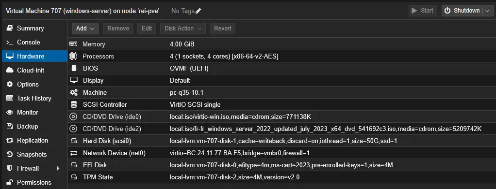

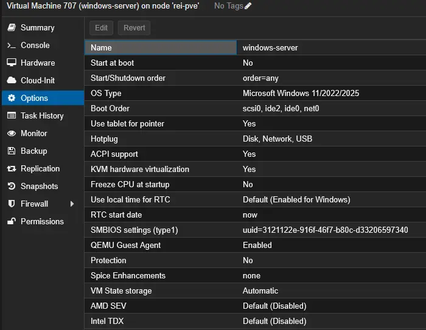

**Configuration réseau :**

| Paramètre  | Valeur                     |
| ---------- | -------------------------- |
| Bridge     | vmbr0 (réseau de lab)      |
| Modèle     | VirtIO (drivers optimisés) |
| Adresse IP | 1.69.1.207                 |

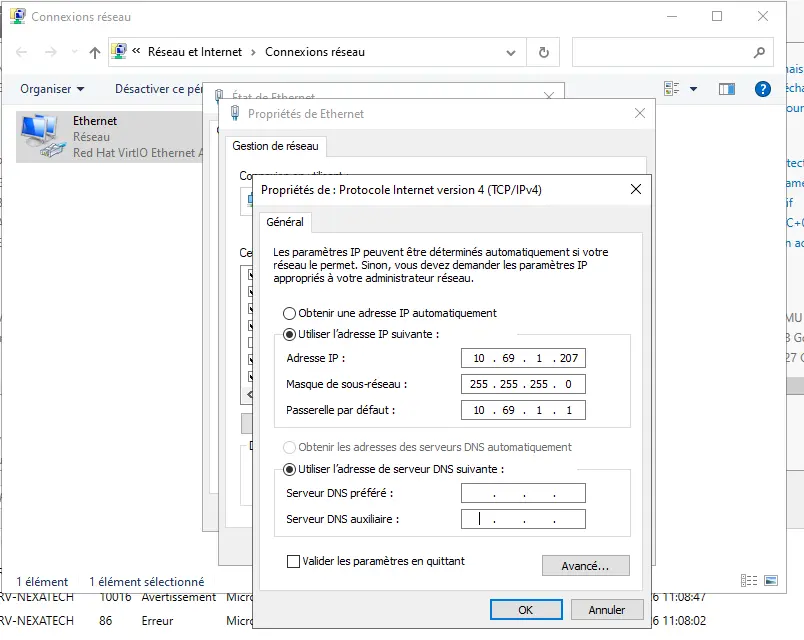

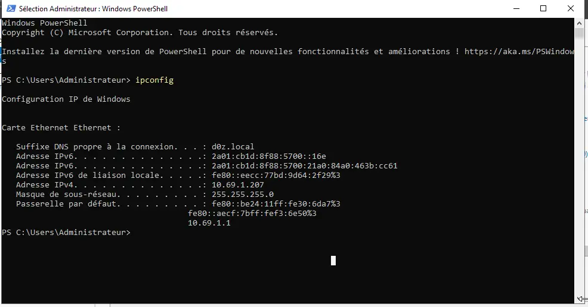

### 2. Déploiement de la forêt Active Directory

**Test de déploiement :**

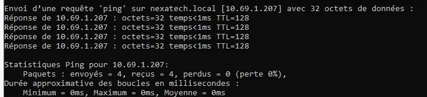

**Explication technique :**

- La forêt Active Directory (AD) est l'instance racine du service d'annuaire.
- Le nom `nexatech.local` suit la convention **.local** (interne, non routable publiquement).
- Le déploiement inclut automatiquement les services :
  - **DNS** (résolution interne)
  - **Kerberos** (authentification sécurisée)
  - **LDAP** (annuaire)

**Impact :** Infrastructure de base opérationnelle pour la gestion centralisée des identités.

## Configuration des stratégies de groupe (GPO)

Configuration de la Default Domain Policy qui sera la politique de domaine globale :

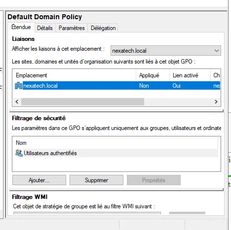

### 3. Politique de mot de passe

- Conserver I'historique des mots de passe - 24 mots de passe memorises
- Duree de vie maximale du mot de passe - 60 jours
- Duree de vie minimale du mot de passe - 1 jour
- Le mot de passe doit respecter des exigences de complexite - Activé
- Longueur minimale du mot de passe - 14 caractère(s)

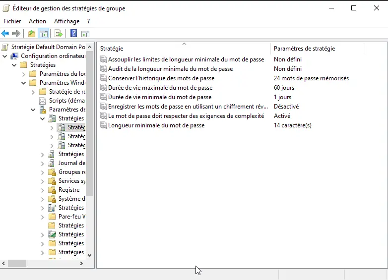

**Explication technique :**

- La **complexité** active la validation par la DLL `passfilt.dll` (3 des 4 catégories de caractères).
- L'**historique** de 24 mots empêche l'alternance rapide entre 2 mots de passe.
- Ces réglages respectent les **recommandations ANSSI** pour un environnement sensible.

### 4. Politique de verrouillage des comptes

- Duree de verrouillage des comptes - 15 minutes
- Reinitialiser le compteur de verrouillages du compte apres - 15 minutes
- Seuil de verrouillage du compte - 5 tentatives d'ouvertures de session

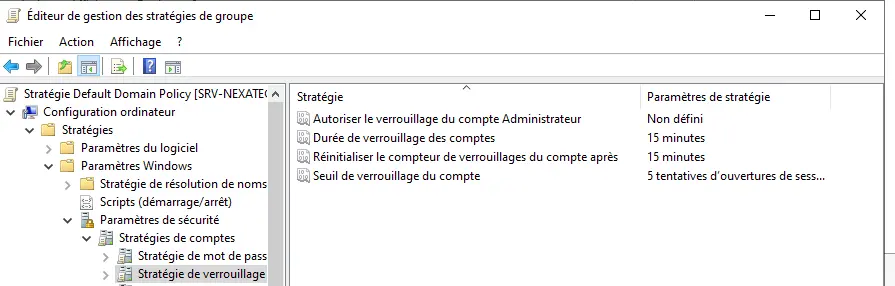

**Explication technique :**

- Le **seuil de 5 tentatives** bloque les attaques par force brute en ligne.
- La **durée de 15 minutes** évite un DoS permanent tout en protégeant l'accès.
- Ces paramètres s'appliquent à tous les comptes de domaine (sauf administrateur intégré).

## Audit de l'état initial d'Active Directory

### 5. Comptes inactifs

```powershell
Import-Module ActiveDirectory 
Search-ADAccount -AccountInactive -UsersOnly -TimeSpan 180.00:00:00 | Select-Object Name,SamAccountName,LastLogonDate,Enabled
```

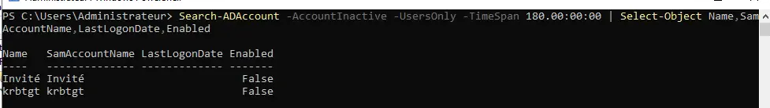

**Analyse :**

- `-TimeSpan 180.00:00:00` = recherche les comptes inactifs depuis 180 jours.
- Aucun compte inactif détecté - environnement propre.

**Explication technique :**

- Un compte inactif est une porte dérobée potentielle (ancien employé, compte de service oublié).
- La détection doit être automatisée mensuellement.

### 6. Groupes sensibles

```powershell
Get-ADGroupMember "Domain Admins" | Select-Object Name,SamAccountName,objectClass
```

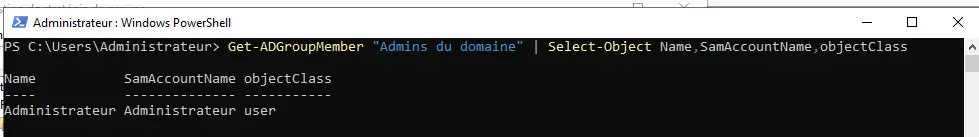

**Analyse :**

- Seul l'administrateur par défaut (`Administrator`) est membre de `Domain Admins`.
- Absence de comptes standards ou de services dans ce groupe critique.

**Principe de moindre privilège :**

- Seuls les utilisateurs strictement nécessaires doivent être `Domain Admins`.
- Idéalement : un compte quotidien sans droits AD, et un compte dédié `*-admin` pour les élévations.

## Désactivation des protocoles vulnérables

### 7. Désactivation de SMBv1

**Vérification de l'état :**

```powershell
Get-WindowsOptionalFeature -Online -FeatureName SMB1Protocol
```

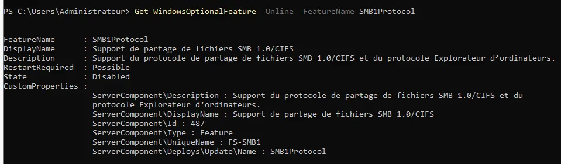

**Désactivation :**

```powershell
Disable-WindowsOptionalFeature -Online -FeatureName SMB1Protocol -NoRestart
```

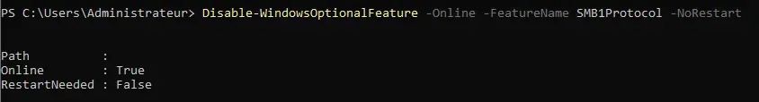

**Explication technique :**

- **SMBv1** est un protocole de partage de fichiers obsolète (Windows NT4/2000).
- Vulnérabilités critiques connues : **WannaCry**, **EternalBlue** (CVE-2017-0144).
- Son remplacement par **SMBv2/v3** (chiffré et signé) est obligatoire.

### 8. Réduction de NTLMv1

**Contexte :** NTLMv1 doit être évité au profit de **Kerberos** (authentification native AD). Si NTLM est indispensable, seule la version 2 est acceptable.

**Configuration :**

```powershell
New-ItemProperty -Path "HKLM:\SYSTEM\CurrentControlSet\Control\Lsa" -Name "LmCompatibilityLevel" -Value 5 -PropertyType DWord -Force
```

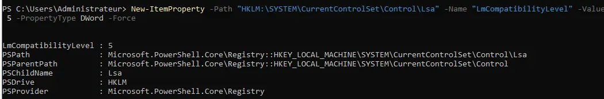

**Explication technique :**

| Valeur | Signification                                     | Sécurité     |
| ------ | ------------------------------------------------- | ------------ |
| 0-1    | Accepte NTLMv1, LM (les moins sécurisés)          | **Nulle**    |
| 2      | Accepte NTLMv1 si nécessaire (négociation)        | Faible       |
| 3      | Envoie uniquement NTLMv2 (accepte NTLMv1 entrant) | Moyenne      |
| 4      | Envoie uniquement NTLMv2 (refuse NTLMv1 entrant)  | Haute        |
| **5**  | **Refuse NTLMv1 et LM (rejet total)**             | **Maximale** |

**Valeur appliquée :** `5` - Rejet total de NTLMv1 et LM.

## Validation des modifications

### 9. Application forcée des GPO

```powershell
gpupdate /force
```

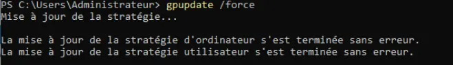

**Explication :**

- `gpupdate /force` réapplique toutes les GPO (stratégies locales et de domaine).
- Absence d'erreur = politiques correctement appliquées sur le contrôleur.

### 10. Génération du rapport d'audit GPO

```powershell
gpresult /h rapport.html
```

**Extrait du rapport :**

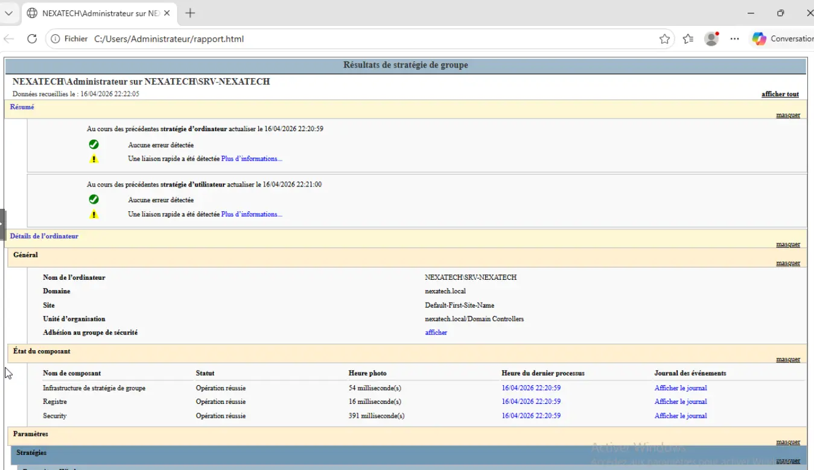

**Explication :**

- `gpresult /h` génère un rapport HTML détaillé (paramètres appliqués, GPO prioritaires, filtres WMI).
- Ce rapport doit être archivé pour preuve de conformité et audit externe.

## Synthèse des actions de hardening

| Composant                 | Action principale                        | Niveau de risque avant | Niveau après |
| ------------------------- | ---------------------------------------- | ---------------------- | ------------ |
| Politique de mot de passe | Complexité + longueur 14 + historique 24 | **CRITIQUE**           | **FAIBLE**   |
| Verrouillage des comptes  | Seuil 5 + durée 15 min                   | **ÉLEVÉ**              | **NUL**      |
| SMBv1                     | Désactivation complète                   | **CRITIQUE**           | **NUL**      |
| NTLMv1                    | Refus total (LmCompatibilityLevel = 5)   | **ÉLEVÉ**              | **NUL**      |
| Groupes sensibles         | Audit + restriction Domain Admins        | **ÉLEVÉ**              | **FAIBLE**   |
| Comptes inactifs          | Détection et désactivation               | **MOYEN**              | **NUL**      |

---

## Conclusion de la phase

**Ce qui a été corrigé :**

1. **Authentification renforcée** : mots de passe complexes (14 caractères, historique 24), verrouillage à 5 échecs.
2. **Protocoles obsolètes désactivés** : SMBv1 (EternalBlue) et NTLMv1 (relay attacks).
3. **Gouvernance des comptes** : audit des inactifs, groupe Domain Admins restreint.
4. **Traçabilité** : rapports GPO générés (`gpresult`) pour validation.

**Ce qui reste à surveiller / améliorer :**

| Action                                   | Priorité  | Fréquence recommandée       |
| ---------------------------------------- | --------- | --------------------------- |
| Déploiement de **LAPS**                  | **Haute** | Avant mise en production    |
| Activation de **Windows Defender** + ASR | **Haute** | Immédiatement               |
| Mise en place de **PowerShell logging**  | **Haute** | Dès que possible            |
| Configuration de **Windows Firewall**    | Moyenne   | Avant exposition réseau     |
| Rotation des mots de passe KRBTGT        | Moyenne   | Annuelle                    |
| Activation de **Credential Guard**       | Basse     | Après validation matérielle |

- **LAPS** permet de gérer un mot de passe administrateur local unique et aléatoire pour chaque machine du domaine, évitant qu'un même mot de passe ne compromette l'ensemble du parc.
- **Windows Defender** est l'antivirus natif de Microsoft, et **ASR** (Attack Surface Reduction) est un ensemble de règles qui bloque les comportements malveillants courants (scripts, macros, ransomware).
- Le pare-feu Windows filtre le trafic réseau entrant et sortant selon le principe du moindre privilège (bloquer tout sauf ce qui est strictement nécessaire).
- Le compte **KRBTGT** est le compte système qui signe tous les tickets Kerberos du domaine, et changer son mot de passe régulièrement invalide les tickets volés (Golden Ticket attack).
- **Credential Guard** utilise la virtualisation (VBS) pour isoler et protéger les secrets d'authentification (hashs NTLM, tickets Kerberos) même si le noyau Windows est compromis.

**Prochaine phase recommandée :**

- Test de pénétration interne (BloodHound, CrackMapExec).
- Mise en place d'une solution de **SIEM** (Wazuh, Splunk) pour centraliser les logs.
- Documentation des procédures de restauration d'AD.

Le contrôleur de domaine `nexatech.local` est désormais **durci selon les standards de base** (CIS Level 1) et prêt pour un environnement de pré-production.
