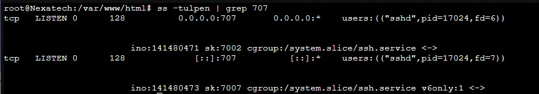
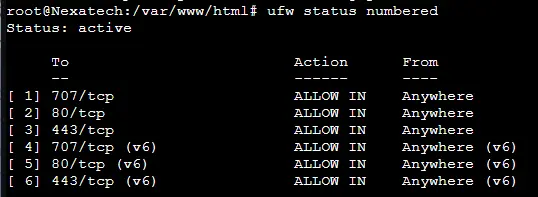
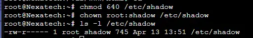
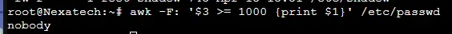
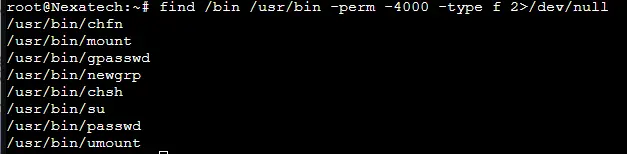

↑ [README](README.md)  | [Rapport d'audit](../rapport_audit.md)

---

# hardening serveur linux

## Objectif de la phase

1. **Sécurisation des accès SSH** (changement du port, clé SSH uniquement, algorithmes forts).
2. **Mise en place d'un pare-feu** (UFW) pour filtrer les connexions entrantes.
3. **Renforcement des permissions** sur les fichiers critiques système.
4. **Audit des comptes utilisateurs** et des binaires SUID.
5. **Documentation des actions** pour traçabilité et reproductibilité.

## Environnement de Test

Le hardening a été réalisé sur le serveur Linux (Debian) hébergeant l'instance DVWA (voir [infrastructure](../cartographie_infrastructure/cartographie_infrastructure.md)).

**Spécifications :**

- OS : Debian 12 (Bookworm)
- Services exposés : SSH, HTTP (80), HTTPS (443)
- Utilisateur cible : `nexa_tech`

## Analyse et corrections appliquées

### 1. Sécurisation de l'accès SSH

#### 1.1 Création de la clé SSH (côté client)

```bash
ssh-keygen -t ed25519 -f ~/.ssh/id_ed25519_service_$(date +%Y-%m-%d) -C "Service key for nexa_tech"
```

- `ed25519` : algorithme de signature moderne, plus sécurisé et plus rapide que RSA.
- Date dans le nom : permet la rotation et l'identification des clés.
- Label (`-C`) : ajoute un commentaire pour identifier l'usage.

#### 1.2 Déploiement de la clé publique sur le serveur

```bash
mkdir /home/nexa_tech/.ssh
cat > /home/nexa_tech/.ssh/authorized_keys << EOF
ssh-ed25519 AAAAC3NzaC1lZDI1NTE5AAAAIET49cZnJGIqQbK7egeeCoM24/etFa+hM5C2pbfTSNgB Service key for nexa_tech
EOF
```

Mise en place des permissions appropriées sur les fichiers SSH :

```bash
chmod 700 /home/nexa_tech/.ssh
chmod 600 /home/nexa_tech/.ssh/authorized_keys
chown -R nexa_tech:nexa_tech /home/nexa_tech/.ssh
```

- `chmod 700` : seul le propriétaire peut lire, écrire et exécuter (entrer) dans le dossier.
- `chmod 600` : seul le propriétaire peut lire et écrire le fichier des clés autorisées.
- Ces permissions empêchent tout autre utilisateur (ou processus compromis) de modifier les clés.

#### 1.3 Modification de la configuration SSH

**Backup préalable :**

```bash
cp /etc/ssh/sshd_config /etc/ssh/sshd_config.bak
```

**Configuration appliquée** (basée sur les [recommandations Mozilla](https://infosec.mozilla.org/guidelines/openssh)) :

```bash
# Supported HostKey algorithms by order of preference.
HostKey /etc/ssh/ssh_host_ed25519_key
HostKey /etc/ssh/ssh_host_rsa_key
HostKey /etc/ssh/ssh_host_ecdsa_key

KexAlgorithms curve25519-sha256@libssh.org,ecdh-sha2-nistp521,ecdh-sha2-nistp384,ecdh-sha2-nistp256,diffie-hellman-group-exchange-sha256

Ciphers chacha20-poly1305@openssh.com,aes256-gcm@openssh.com,aes128-gcm@openssh.com,aes256-ctr,aes192-ctr,aes128-ctr

MACs hmac-sha2-512-etm@openssh.com,hmac-sha2-256-etm@openssh.com,hmac-sha2-512,hmac-sha2-256,umac-128@openssh.com

# Password based logins are disabled - only public key based logins are allowed.
AuthenticationMethods publickey

# LogLevel VERBOSE logs user's key fingerprint on login. Needed to have a clear audit track of which key was using to log in.
LogLevel VERBOSE

Port 707
PermitRootLogin no
PubkeyAuthentication yes
AuthorizedKeysFile .ssh/authorized_keys
PasswordAuthentication no
PermitEmptyPasswords no

MaxSessions 2

UsePAM yes

# disable X11 forwarding as X11 is very insecure
X11Forwarding no

PrintMotd no
AcceptEnv LANG LC_*

# Log sftp level file access (read/write/etc.) that would not be easily logged otherwise.
Subsystem sftp /usr/lib/openssh/sftp-server -f AUTHPRIV -l INFO

# only use the newer, more secure protocol
Protocol 2
```

**Explication technique des directives principales :**

| Directive                   | Effet                                                                                                |
| --------------------------- | ---------------------------------------------------------------------------------------------------- |
| `Port 707`                  | Déplace SSH sur un port non standard, réduit les scans automatiques et les attaques par force brute. |
| `PermitRootLogin no`        | Empêche la connexion directe en root. L'administrateur doit d'abord se connecter avec `nexa_tech`.   |
| `PasswordAuthentication no` | Bloque toute tentative d'authentification par mot de passe. Seule la clé privée est acceptée.        |
| `LogLevel VERBOSE`          | Enregistre l'empreinte (fingerprint) de la clé utilisée. Permet une traçabilité précise.             |
| `MaxSessions 2`             | Limite le nombre de sessions simultanées, réduit la surface d'attaque DoS.                           |
| `X11Forwarding no`          | Désactive le transfert X11 (historiquement vulnérable).                                              |

#### 1.4 Vérification du nouveau port d'écoute

```bash
ss -tulpen | grep 707
```



**Interprétation :** Le service SSH écoute bien sur le port 707/TCP, en IPv4 et IPv6.

**Impact de la correction :** réduction drastique de la surface d'attaque sur SSH

### 2. Configuration du pare-feu UFW

**Commandes exécutées :**

```bash
apt install ufw -y
ufw enable

ufw allow 707/tcp # port SSH modifié
ufw allow 80/tcp # HTTP
ufw allow 443/tcp # HTTPS
ufw default deny incoming
ufw default allow outgoing
```

**Vérification des règles :**

```bash
ufw status numbered
```

**Résultat :**



**Explication technique :**

- `deny incoming` : bloque toute connexion entrante non explicitement autorisée.
- `allow outgoing` : autorise toutes les connexions sortantes (mises à jour, DNS, etc.).
- Le principe est de **whitelist** : seuls les services nécessaires sont exposés.

**Impact de la correction :** Filtrage réseau systématique, réduction des ports ouverts.

### 3. Renforcement des permissions sur les fichiers critiques

#### 3.1 Fichier `/etc/shadow`

**Commande exécutée :**

```bash
chmod 640 /etc/shadow
chown root:shadow /etc/shadow
```

**Résultat :**



**Explication technique :**

- `/etc/shadow` contient les mots de passe hachés des utilisateurs.
- Permissions d'origine (souvent `640` ou `600`) : ici on s'assure que seul `root` et le groupe `shadow` peuvent lire.
- Évite qu'un utilisateur non privilégié ne lise les hashs et tente de les casser (hors ligne).

#### 3.2 Vérification des comptes utilisateurs

**Commande exécutée :**

```bash
awk -F: '$3 >= 1000 {print $1}' /etc/passwd
```

| Élément       | Signification                                                           |
| ------------- | ----------------------------------------------------------------------- |
| `awk`         | Langage de traitement de texte ligne par ligne                          |
| `-F:`         | Définit `:` comme séparateur de champs (au lieu de l'espace par défaut) |
| `$3`          | Troisième champ de chaque ligne (le champ UID dans `/etc/passwd`)       |
| `>= 1000`     | Condition : UID supérieur ou égal à 1000                                |
| `{print $1}`  | Affiche le premier champ (le nom d'utilisateur)                         |
| `/etc/passwd` | Fichier contenant les comptes utilisateurs du système                   |

**Résultat :** Affiche la liste des **utilisateurs "normaux"** (non système), car les UID des utilisateurs système sont généralement < 1000.



**Analyse :**

- Aucun compte standard inutile (UID ≥ 1000) détecté.
- Seul `nobody` est présent (compte système, normal).
- Absence d'anciens comptes ou backdoors.

#### 3.3 Audit des binaires SUID

**Commande exécutée :**

```bash
find /bin /usr/bin -perm -4000 -type f 2>/dev/null
```

**Résultat :**



**Explication technique :**

- Un binaire **SUID** s'exécute avec les privilèges du propriétaire (souvent root).
- Un SUID mal configuré peut permettre une élévation de privilèges.
- La liste doit être régulièrement auditée pour retirer les SUID superflus.

**Actions recommandées (hors périmètre immédiat) :**

- Supprimer le SUID de `/bin/mount` et `/bin/umount` si non nécessaire.
- Surveiller tout nouveau binaire SUID apparaissant après une mise à jour.

**Impact de la correction :** Réduction des risques d'élévation de privilèges locale.

## Conclusion de la phase

### Ce qui a été corrigé :

1. **Accès SSH sécurisé** : plus de mot de passe, port déplacé, algorithmes modernes, journalisation des clés.
2. **Pare-feu actif** : seuls les ports 707 (SSH), 80 (HTTP) et 443 (HTTPS) sont ouverts entrant.
3. **Permissions durcies** : `/etc/shadow` protégé, aucun compte inutile, audit SUID effectué.

### Ce qui reste à surveiller / améliorer :

| Action                                | Priorité | Fréquence recommandée        |
| ------------------------------------- | -------- | ---------------------------- |
| Mise en place de **fail2ban**         | Haute    | Avant mise en production     |
| Surveillance des logs SSH             | Haute    | Quotidienne (via logwatch)   |
| Rotation des clés SSH                 | Moyenne  | Tous les 6 mois              |
| Audit automatique des SUID            | Moyenne  | Hebdomadaire (cron + diff)   |
| Mise en place de **AIDE** (intégrité) | Basse    | Mensuelle                    |
| Activation de **SELinux/AppArmor**    | Basse    | Après validation applicative |

### Prochaine phase recommandée

- Test de pénétration externe pour valider le durcissement.
- Mise en place d'une politique de mise à jour automatique (unattended-upgrades).
- Documentation des procédures de restauration en cas de perte de clé SSH.

Le serveur est désormais considéré comme **durci pour un environnement de pré-production**.
