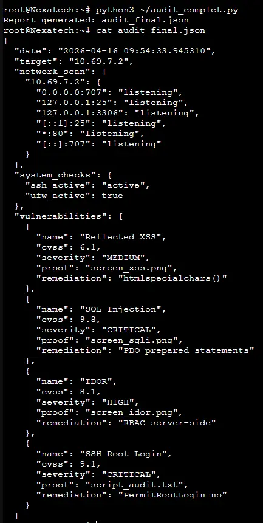
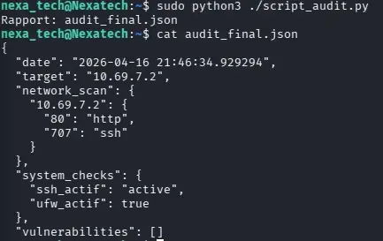

↑ [README](README.md) | [Rapport d'audit](../rapport_audit.md)

---

# Script audit complet

```python
import nmap, subprocess, json, datetime

class AuditSecurite:
    def __init__(self, target):
        self.target = target
        self.results = {
            'date': str(datetime.datetime.now()),
            'target': target,
            'network_scan': {},
            'system_checks': {},
            'vulnerabilities': []
        }

    def scan_reseau(self):
        nm = nmap.PortScanner()
        nm.scan(self.target, '1-1024', '-sV --open')
        for host in nm.all_hosts():
            ports = {}
            for proto in nm[host].all_protocols():
                for port in nm[host][proto]:
                    ports[port] = nm[host][proto][port]['name']
            self.results['network_scan'][host] = ports
        return self

    def check_systeme(self):
        checks = {}
        # SSH
        r = subprocess.run(['systemctl', 'is-active', 'ssh'],
                          capture_output=True, text=True)
        checks['ssh_actif'] = r.stdout.strip()
        # UFW
        r = subprocess.run(['ufw', 'status'],
                          capture_output=True, text=True)
        checks['ufw_actif'] = 'active' in r.stdout.lower()
        self.results['system_checks'] = checks
        return self

    def generer_rapport(self, filename):
        with open(filename, 'w') as f:
            json.dump(self.results, f, indent=2, ensure_ascii=False)
        print(f'Rapport: {filename}')
        return self

    def ajouter_vuln(self, name, cvss, proof, rem):
        sev = ('CRITIQUE' if cvss >= 9
               else 'HAUTE' if cvss >= 7
               else 'MOYENNE' if cvss >= 4
               else 'FAIBLE')
        self.results['vulnerabilities'].append({
            'name': name,
            'cvss': cvss,
            'severity': sev,
            'proof': proof,
            'remediation': rem
        })
        return self

# Usage :
audit = AuditSecurite('10.69.7.2')
audit.scan_reseau().check_systeme().generer_rapport('audit_final.json')
```

## Exemple d'output




