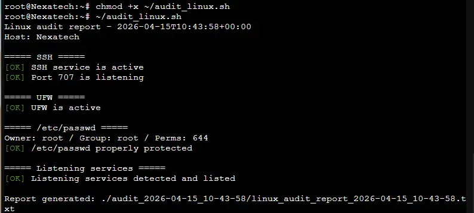
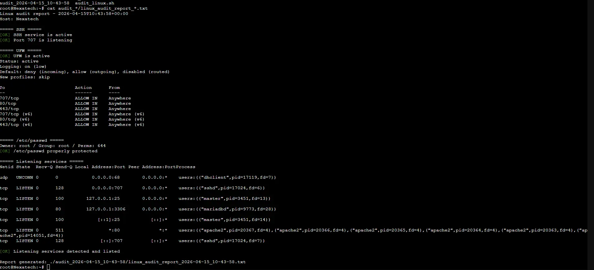

↑ [README](README.md)

---

# Script bash v1

```bash
#!/usr/bin/env bash
set -u

DATE="$(date +%Y-%m-%d_%H-%M-%S)"
OUTDIR="./audit_${DATE}"
REPORT="${OUTDIR}/rapport_audit_${DATE}.txt"

mkdir -p "$OUTDIR"


RED='\033[0;31m'
GREEN='\033[0;32m'
YELLOW='\033[1;33m'
NC='\033[0m'


ok()   { echo -e "${GREEN}[OK]${NC} $1" | tee -a "$REPORT"; }

warn() { echo -e "${YELLOW}[WARN]${NC} $1" | tee -a "$REPORT"; }

fail() { echo -e "${RED}[FAIL]${NC} $1" | tee -a "$REPORT"; }

section() { echo -e "\n===== $1 =====" | tee -a "$REPORT"; }


check_ssh() {
  section "SSH"

  if systemctl is-active --quiet ssh || systemctl is-active --quiet sshd; then
    ok "Service SSH actif"

    ss -tlnp | grep -E ':22\b' >/dev/null && ok "Port 22 à l'écoute" || warn "Port 22 non détecté"
  else
    fail "Service SSH inactif"
  fi

}


check_ufw() {
  section "UFW"

  if command -v ufw >/dev/null 2>&1; then
    if ufw status | grep -qi "Status: active"; then
      ok "UFW actif"
      ufw status verbose | tee -a "$REPORT" >/dev/null
    else
      warn "UFW installé mais inactif"
    fi
  else
    warn "UFW non installé"
  fi

}


check_passwd_permissions() {
  section "/etc/passwd"

  perms="$(stat -c %a /etc/passwd 2>/dev/null || echo unknown)"

  owner="$(stat -c %U /etc/passwd 2>/dev/null || echo unknown)"

  group="$(stat -c %G /etc/passwd 2>/dev/null || echo unknown)"

  echo "Owner: $owner / Group: $group / Perms: $perms" | tee -a "$REPORT"

  [[ "$perms" == "644" || "$perms" == "664" ]] && ok "/etc/passwd correctement protégé" || warn "Permissions à vérifier"

}


check_listening_services() {
  section "Services en écoute"
  ss -tulpn | tee -a "$REPORT" >/dev/null

  if ss -tulpn | grep -q LISTEN; then
    ok "Services en écoute détectés et listés"
  else
    warn "Aucun service en écoute trouvé"
  fi
}

main() {
  echo "Rapport d'audit Linux - $(date -Is)" | tee "$REPORT"
  echo "Hôte: $(hostname)" | tee -a "$REPORT"

  check_ssh
  check_ufw

  check_passwd_permissions
  check_listening_services

  echo "\nRapport généré : $REPORT" | tee -a "$REPORT"
}

main "$@"
```

## Exemple d'output



