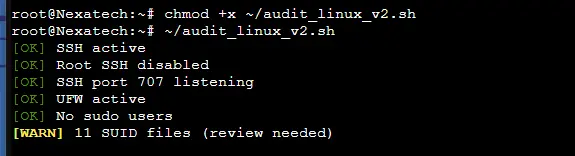

↑ [README](README.md) | [Rapport d'audit](../rapport_audit.md)

---

# Script bash v2

```bash
#!/bin/bash​

DATE=$(date '+%Y%m%d_%H%M%S')​
REPORT="audit_linux_$DATE.txt"​
RED='\033[0;31m' YELLOW='\033[1;33m' GREEN='\033[0;32m' NC='\033[0m'​

log_ok() { echo -e "${GREEN}[OK] ${NC} $1" | tee -a $REPORT; }​

log_warn() { echo -e "${YELLOW}[WARN] ${NC} $1" | tee -a $REPORT; }​

log_critical() { echo -e "${RED}[CRITICAL]${NC} $1" | tee -a $REPORT; }​

# SSH checks​
[ $(systemctl is-active ssh) = 'active' ] && log_ok 'SSH actif' || log_critical 'SSH inactif'​

grep -q 'PermitRootLogin no' /etc/ssh/sshd_config && log_ok 'Root SSH désactivé' || log_critical 'Root SSH ACTIF!'​

grep -q 'PasswordAuthentication no' /etc/ssh/sshd_config && log_ok 'Auth par clé' || log_warn 'Password auth activé'​

# UFW checks​
[ $(ufw status | grep -c 'Status: active') -gt 0 ] && log_ok 'UFW actif' || log_critical 'UFW inactif!'​

# Sudo users​
SUDO_USERS=$(getent group sudo | cut -d: -f4)​

[ -n "$SUDO_USERS" ] && log_warn "Utilisateurs sudo: $SUDO_USERS" || log_ok 'Aucun utilisateur sudo'​

# SUID files​
SUID=$(find / -perm -4000 2>/dev/null | wc -l)​

[ $SUID -gt 10 ] && log_warn "$SUID fichiers SUID (vérifier)" || log_ok "$SUID fichiers SUID (normal)"​

echo "" | tee -a $REPORT​

echo "=== Rapport généré : $REPORT ===" | tee -a $REPORT​
```

## Exemple d'output


