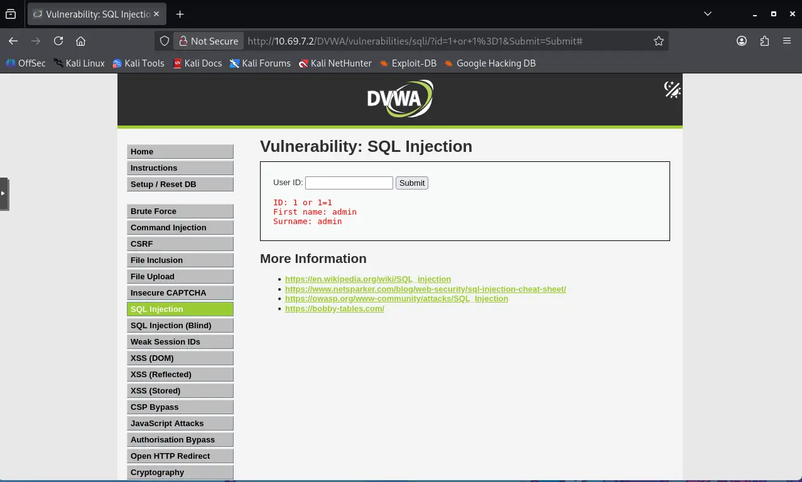
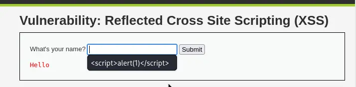
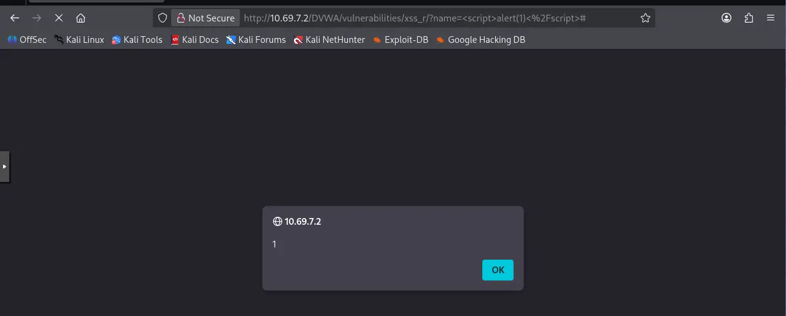
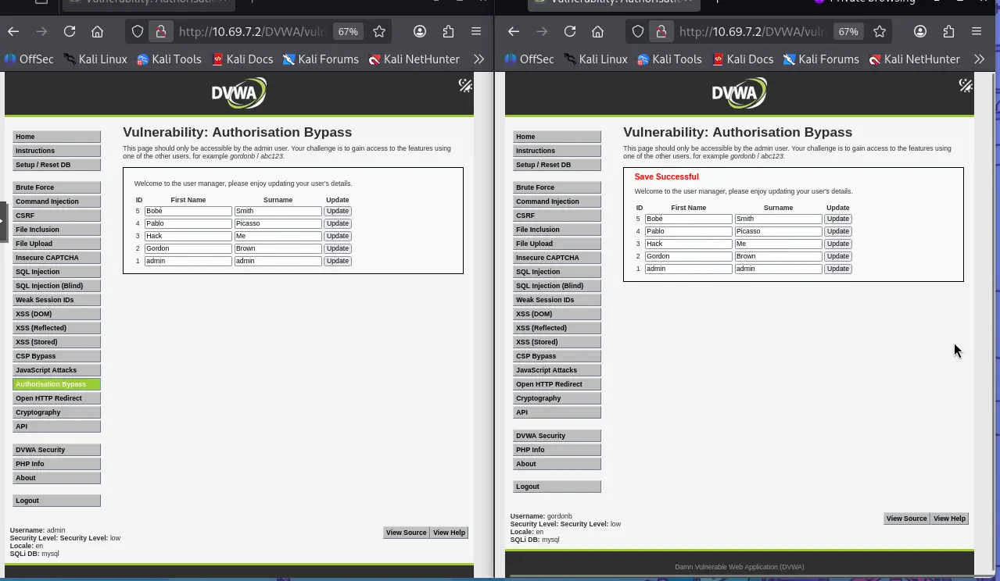
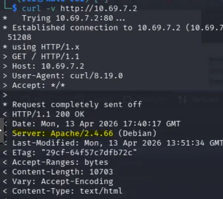

↑ [vulnérabilités applicatives](vulnerabilites_applicatives.md)

---

# Vulnérabilités applicatives DVWA

## 1. SQL Injection

Module : SQL Injection  
Payload :

```sql
1' or '1'='1
```



Résultat :

- récupération de l'utilisateur admin
- fuite d'informations en base

Impact :

- accès non autorisé aux données
- extraction d'utilisateurs

---

## 2. XSS Reflected

Module : XSS (Reflected)  
Payload :

```html
<script>
  alert(1);
</script>
```





Résultat :

- popup JavaScript exécutée

Impact :

- exécution JS côté client
- vol de session possible

---

## 3. Mauvaise gestion d'authentification et IDOR

Module : Authorisation Bypass

Preuve :

Accès  à L’URL `/vulnerabilities/authbypass/` par l'utilisateur `gordonb` et modification d'un utilisateur



Résultat :

- accès à une page réservée à l'administrateur
- modification possible des utilisateurs

Impact :

- élévation de privilèges
- accès non autorisé

---

## 4. Weak Session IDs

Module : Weak Session IDs

Preuve :

- cookie dvwaSession = 7
- valeur incrémentale et prévisible

Impact :

- prédiction de session
- session hijacking possible

---

## 5. Mauvais headers HTTP

Commande :

```bash
curl -v http://10.69.7.2
```



Résultat :

- Server: Apache/2.4.66 (Debian)
- divulgation de version Apache
- absence de headers de sécurité visibles
